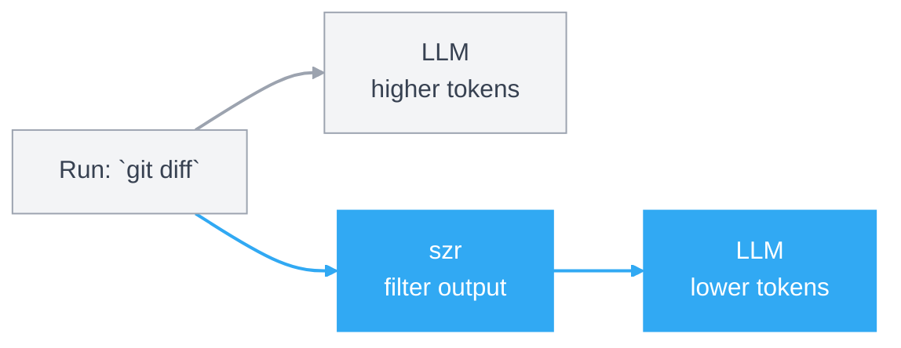

<p align="center">
  
</p>

# szr

`szr` is short for "sizer". It is a Go-native CLI proxy that trims command output before it reaches an LLM, so the model gets the signal without paying for every line of terminal noise.

## How it works




## Current status

The first working scaffold is in place:

- `szr git status`, `szr git log`, and `szr git diff` use dedicated profiles.
- `szr go test` forces `-json` and summarizes package-level failures.
- `szr cargo test`, `szr cargo build`, and `szr cargo clippy` now use Rust-aware reducers.
- `szr uv`, `szr poetry`, `szr pip`, `szr pytest`, `szr ruff`, and `szr mypy` now use Python-aware reducers.
- `szr make`, `szr just`, `szr task`, `szr bazel`, `szr ninja`, and `szr cmake` now use build-system reducers.
- `szr ctest`, `szr clang-tidy`, `szr clang-format`, and `szr bear` now use C/C++ tooling reducers.
- `szr docker ps`, `szr docker compose ps`, `szr docker logs`, and `szr docker compose logs` now use container-aware reducers.
- `szr kubectl get`, `szr kubectl describe`, `szr kubectl logs`, `szr kubectl top`, and `szr kubectl events` now use Kubernetes-aware reducers.
- `szr gh pr view`, `szr gh pr checks`, `szr gh run list`, `szr gh run view`, and `szr gh run view --log` now use GitHub-aware reducers.
- `szr npm`, `szr pnpm`, `szr yarn`, `szr bun`, `szr turbo`, `szr nx`, `szr vite`, `szr vitest`, `szr jest`, `szr eslint`, and `szr tsc` now use JS/TS-aware profiles.
- `szr terraform`, `szr tofu`, `szr helm`, `szr gradle`, `szr mvn`, and `szr docker build` now route through build-style reducers.
- `szr diff`, `szr patch`, and `szr git apply` now use patch-aware reducers.
- `szr rg` now uses a ripgrep-aware reducer that groups matches by file.
- `szr read`, `szr grep`, `szr json`, `szr log`, and `szr ls` are implemented directly in Go.
- `szr spread` tracks token savings in local JSONL history.
- `szr recommend`, `szr hotspots`, `szr compare`, and `szr replay` now turn history and preserved artifacts into tuning workflows.
- `szr explain <cmd...>` shows which profile the engine would use and why.
- `szr tee`, `szr tee find`, and `szr tee prune` manage indexed failure artifacts so full logs can be retrieved only when needed.
- `szr install <target>` bootstraps repo-local instructions and hook files for Codex, Claude Code, Cursor, Gemini, and plain shell environments.
- `szr rules check`, `szr rules test`, and `szr scaffold profile` make project-local rules safer to iterate on.
- `szr bench` runs built-in compression fixtures to measure latency and output savings.
- project-local `.szr.json`, `.szr.yaml`, and `.szr.yml` rules can define custom profiles plus machine-readable `preferences` for internal CLIs, generated tooling, and cwd-aware command rewrites.

## Why build this in Go

- Fast single-binary distribution.
- Straightforward cross-platform process execution.
- Good fit for structured parsers and profile registries.
- Easier to keep the architecture modular as the command surface grows.

## Install

There are now two separate install layers:

- global install: make the `szr` binary available on your shell `PATH`
- repo bootstrap: teach a specific repo and agent environment to prefer `szr`

### Global install

From a local checkout, install the binary into your Go bin directory:

```bash
go install ./cmd/szr
szr self doctor
```

Or build locally and let `szr` install itself into `~/.local/bin` or `~/bin`:

```bash
make build
./bin/szr self install
./bin/szr self doctor
```

If your shell does not already include that install directory on `PATH`, `szr self install` prints the exact line to add to `~/.zshrc`, `~/.bashrc`, or the detected shell rc file. To let `szr` append that line for you:

```bash
./bin/szr self install --update-shell
```

### Repo bootstrap

Once the binary is globally available, bootstrap repo-local guidance separately:

```bash
szr install codex
szr install shell
```

That keeps global binary installation separate from repo-specific agent/editor wiring.

## Usage

```bash
szr git status
szr git diff
szr go test ./...
szr cargo test
szr pytest -k failing_case
szr ruff check .
szr mypy src
szr make test
szr ctest
szr docker logs api
szr kubectl get pods
szr gh run view 123
szr gh run view 123 --log
szr npm test
szr turbo run build
szr git apply fix.patch
szr rg TODO internal
szr grep "TODO" .
szr read internal/cli/app.go --level aggressive
szr spread --history
szr tee
szr tee --latest
szr self install
szr self doctor
szr install codex
szr install shell
szr bench clean-pass
szr explain go test ./...
```

## Local Development

The test suite now lives under `test/`, with coverage enforced against `./internal/...`.
The public Go package lives under `pkg/szr`, while `cmd/szr-dev` is the developer-only launcher path.

```bash
make test
make cover
make smoke
make prepush
```

## Architecture

The codebase is organized around a small execution engine:

- `pkg/szr`: public package entrypoint for embedding or thin launchers
- `cmd/szr`: binary wrapper with `main.go` only
- `cmd/szr-dev`: developer-only binary wrapper
- `internal/bench`: benchmark fixtures and measurement harness
- `internal/cli`: subcommand parsing and dispatch
- `internal/engine`: profile matching, command execution, tee handling
- `internal/installers`: repo-local bootstrap generation for agent/editor targets
- `internal/profiles`: built-in profile registry
- `internal/filters`: text, JSON, grep, git, and test compaction logic
- `internal/history`: local tracking for `szr spread`
- `internal/rules`: project-local rule DSL parsing and validation
- `internal/szrdev`: developer-only launcher wiring
- `internal/config`: config and runtime path resolution

More detail lives in [docs/ARCHITECTURE.md](/Users/alex/Documents/GitHub/szr/docs/ARCHITECTURE.md).

## Roadmap

The current roadmap is organized around three goals:

- lower wrapper latency so `szr` stays on the hot path
- expand parser-first coverage beyond the current Go, Git, Rust, Python, JS/TS, build, C/C++, patch, container, Kubernetes, and GitHub command families
- improve compression quality without hiding actionable failure lines, and extend the bench harness as profiles grow

The detailed plan lives in [docs/ROADMAP.md](/Users/alex/Documents/GitHub/szr/docs/ROADMAP.md).
