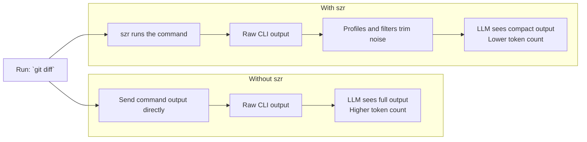

<p align="center">
  
</p>

# szr

`szr` is short for "sizer". It is a Go-native CLI proxy that trims command output before it reaches an LLM, so the model gets the signal without paying for every line of terminal noise.

## How it works




## Current status

The first working scaffold is in place:

- `szr git status`, `szr git log`, and `szr git diff` use dedicated profiles.
- `szr go test` forces `-json` and summarizes package-level failures.
- `szr npm test`, `szr pnpm test`, `szr yarn test`, `szr vitest`, and `szr jest` now use JS/TS-aware profiles.
- `szr read`, `szr grep`, `szr json`, `szr log`, and `szr ls` are implemented directly in Go.
- `szr spread` tracks token savings in local JSONL history.
- `szr explain <cmd...>` shows which profile the engine would use and why.
- `szr install <target>` bootstraps repo-local instructions and hook files for Codex, Claude Code, Cursor, and Gemini.
- `szr bench` runs built-in compression fixtures to measure latency and output savings.
- project-local `.szr.json` rules can define custom match, rewrite, and render behavior.

## Why build this in Go

- Fast single-binary distribution.
- Straightforward cross-platform process execution.
- Good fit for structured parsers and profile registries.
- Easier to keep the architecture modular as the command surface grows.

## Usage

```bash
szr git status
szr git diff
szr go test ./...
szr npm test
szr grep "TODO" .
szr read internal/cli/app.go --level aggressive
szr spread --history
szr install codex
szr bench clean-pass
szr explain go test ./...
```

## Local Development

The test suite now lives under `test/`, with coverage enforced against `./internal/...`.
The public Go package lives under `pkg/szr`, while `cmd/szr-dev` is the developer-only launcher path.

```bash
make test
make cover
make smoke
make prepush
```

## Architecture

The codebase is organized around a small execution engine:

- `pkg/szr`: public package entrypoint for embedding or thin launchers
- `cmd/szr`: binary wrapper with `main.go` only
- `cmd/szr-dev`: developer-only binary wrapper
- `internal/bench`: benchmark fixtures and measurement harness
- `internal/cli`: subcommand parsing and dispatch
- `internal/engine`: profile matching, command execution, tee handling
- `internal/installers`: repo-local bootstrap generation for agent/editor targets
- `internal/profiles`: built-in profile registry
- `internal/filters`: text, JSON, grep, git, and test compaction logic
- `internal/history`: local tracking for `szr spread`
- `internal/rules`: project-local rule DSL parsing and validation
- `internal/szrdev`: developer-only launcher wiring
- `internal/config`: config and runtime path resolution

More detail lives in [docs/ARCHITECTURE.md](/Users/alex/Documents/GitHub/szr/docs/ARCHITECTURE.md).

## Roadmap

The current roadmap is organized around three goals:

- lower wrapper latency so `szr` stays on the hot path
- expand parser-first coverage beyond the current Go, Git, and JS/TS command families
- improve compression quality without hiding actionable failure lines, and extend the bench harness as profiles grow

The detailed plan lives in [docs/ROADMAP.md](/Users/alex/Documents/GitHub/szr/docs/ROADMAP.md).
