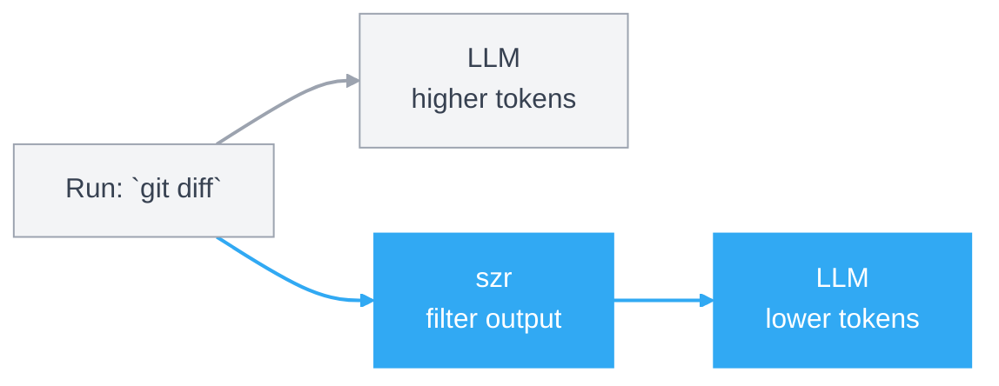

<p align="center">
  
</p>

<p align="center">
  <a href="https://github.com/devr-tools/szr/releases">
    
  </a>

  <a href="https://github.com/devr-tools/szr/actions/workflows/cd.yml">
    
  </a>

  <a href="https://github.com/devr-tools/szr/actions/workflows/ci.yml">
    
  </a>

  <a href="https://github.com/devr-tools/szr/actions/workflows/homebrew-validation.yml">
    
  </a>

  <a href="https://pkg.go.dev/github.com/devr-tools/szr/pkg/szr">
    
  </a>

  <a href="https://goreportcard.com/report/github.com/devr-tools/szr">
    
  </a>

  <a href="https://opensource.org/licenses/MIT">
    
  </a>

  <a href="https://www.linkedin.com/in/alxxjohn">
    
  </a>
</p>

# szr

`szr` is short for "sizer". It is a Go-native CLI proxy that trims command output before it reaches an LLM, so the model gets the signal without paying for every line of terminal noise.

## How it works



## Install

There are now two separate install layers:

- global install: make the `szr` binary available on your shell `PATH`
- repo bootstrap: teach a specific repo and agent environment to prefer `szr`

### Global install

From a local checkout, install the binary into your Go bin directory:

```bash
go install ./cmd/szr
szr self doctor
```

Or build locally and let `szr` install itself into `~/.local/bin` or `~/bin`:

```bash
make build
./bin/szr self install
./bin/szr self doctor
```

If your shell does not already include that install directory on `PATH`, `szr self install` prints the exact line to add to `~/.zshrc`, `~/.bashrc`, or the detected shell rc file. To let `szr` append that line for you:

```bash
./bin/szr self install --update-shell
```

Homebrew is also wired up through this repo's tap:

```bash
# From a local checkout
brew tap devr-tools/szr "$(pwd)"
brew install szr
szr self doctor
```

```bash
# From GitHub
brew tap devr-tools/szr
brew install szr
szr self doctor
```

```bash
# One-line direct install from the tap
brew install devr-tools/szr/szr
szr self doctor
```

```bash
# Latest main branch instead of the stable tag
brew install --HEAD devr-tools/szr/szr
szr self doctor
```

The first stable formula release is `v0.1.0`. Future tagged releases are documented in [docs/RELEASING.md](/docs/RELEASING.md).

### Repo bootstrap

Once the binary is globally available, bootstrap repo-local guidance separately:

```bash
szr install codex
szr install shell
szr uninstall codex
```

That keeps global binary installation separate from repo-specific agent/editor wiring.

## Usage

```bash
# Install szr from GitHub
go install github.com/devr-tools/szr/cmd/szr@latest
szr self doctor

# Bootstrap this repo for agent/shell use
szr install codex
szr install shell

# Run your usual commands through szr
szr git status
szr git diff
szr go test ./...

# Check token savings and command history
szr spread
szr spread --history

# Useful follow-ups
szr tee --latest
szr explain go test ./...
szr commands
```

## Go Package

The public Go package for embedding `szr` is:

```go
import "github.com/devr-tools/szr/pkg/szr"
```

The `pkg.go.dev` pages are:

- library package: `https://pkg.go.dev/github.com/devr-tools/szr/pkg/szr`
- CLI command: `https://pkg.go.dev/github.com/devr-tools/szr/cmd/szr`

## Local Development

The test suite now lives under `test/`, with coverage enforced against `./internal/...`.
The public Go package lives under `pkg/szr`, while `cmd/szr-dev` is the developer-only launcher path.

```bash
make test
make cover
make smoke
make ci
make prepush
```

## Contributing

Public contributions are welcome. Start with [CONTRIBUTING.md](/szr/CONTRIBUTING.md) for local setup, test expectations, commit hygiene, and PR etiquette.

For most code changes, the minimum bar is:

- keep the scope tight
- add or update tests with the behavior change
- run `make fmt` and `make test`
- explain the user-facing impact and verification steps in the PR
