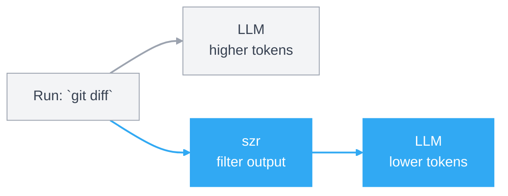

<p align="center">
  
</p>

# szr

`szr` is short for "sizer". It is a Go-native CLI proxy that trims command output before it reaches an LLM, so the model gets the signal without paying for every line of terminal noise.

## How it works



## Install

There are now two separate install layers:

- global install: make the `szr` binary available on your shell `PATH`
- repo bootstrap: teach a specific repo and agent environment to prefer `szr`

### Global install

From a local checkout, install the binary into your Go bin directory:

```bash
go install ./cmd/szr
szr self doctor
```

Or build locally and let `szr` install itself into `~/.local/bin` or `~/bin`:

```bash
make build
./bin/szr self install
./bin/szr self doctor
```

If your shell does not already include that install directory on `PATH`, `szr self install` prints the exact line to add to `~/.zshrc`, `~/.bashrc`, or the detected shell rc file. To let `szr` append that line for you:

```bash
./bin/szr self install --update-shell
```

### Repo bootstrap

Once the binary is globally available, bootstrap repo-local guidance separately:

```bash
szr install codex
szr install shell
```

That keeps global binary installation separate from repo-specific agent/editor wiring.

## Usage

```bash
# Install szr
go install ./cmd/szr
szr self doctor

# Bootstrap this repo for agent/shell use
szr install codex
szr install shell

# Run your usual commands through szr
szr git status
szr git diff
szr go test ./...

# Check token savings and command history
szr spread
szr spread --history

# Useful follow-ups
szr tee --latest
szr explain go test ./...
szr commands
```

## Local Development

The test suite now lives under `test/`, with coverage enforced against `./internal/...`.
The public Go package lives under `pkg/szr`, while `cmd/szr-dev` is the developer-only launcher path.

```bash
make test
make cover
make smoke
make prepush
```

## Architecture

More detail lives in [docs/ARCHITECTURE.md](/Users/alex/Documents/GitHub/szr/docs/ARCHITECTURE.md).
